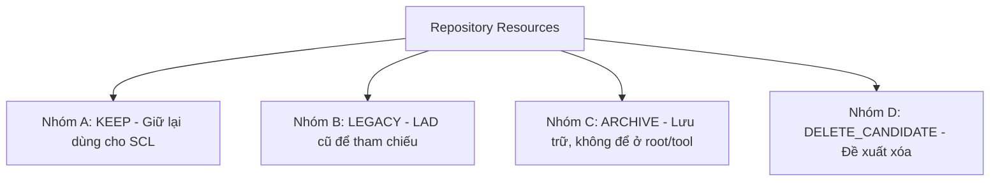

# BẢNG PHÂN LOẠI VÀ KIỂM KÊ THƯ MỤC REPO (REPO CLEANUP INVENTORY)

Tài liệu này kiểm kê và đề xuất phân loại toàn bộ các thư mục, tệp tin hiện hữu trong repository `D:\AI_Agent_PLC_LADDER_ONLY` trước khi tiến hành viết mã nguồn SCL cho dự án mới.

> [!WARNING]
> **Quy định an toàn:**
> Tài liệu này chỉ mang tính chất kiểm kê và đề xuất. **Không thực hiện xóa hoặc di chuyển vật lý** bất kỳ tệp tin nào trong bước này khi chưa được sự đồng ý chính thức từ người dùng/Codex.

---

## 1. Sơ Đồ Phân Loại Tổng Quan

Toàn bộ tài nguyên trong repo được chia thành 4 nhóm chính:

---

## 2. Bảng Kiểm Kê Chi Tiết Theo Thư Mục & Pattern

| Thư mục / File Pattern | Số lượng tệp (ước tính) | Phân loại | Lý do đề xuất | Rủi ro nếu thao tác nhầm |
| :--- | :--- | :--- | :--- | :--- |
| `docs/SCL_*.md`, `docs/PROJECT_MAP.md`, `docs/COMMANDS.md` | ~10 tệp | **KEEP** | Tài liệu quy hoạch, đặc tả kiến trúc SCL và hướng dẫn dự án. | Mất tài liệu hướng dẫn phát triển và kiểm duyệt của Agent. |
| `harness/run_acceptance.py` | 1 tệp | **KEEP** | Script chạy kiểm thử tự động offline (Quality Gate). | Không thể tự động kiểm thử trước khi commit. |
| `scratch/validate_*.py`, `scratch/verify_*.py`, `scratch/test_plc_logic.py` | ~10 tệp | **KEEP** | Các công cụ kiểm thử logic PLC, kiểm tra trùng lặp I/O, kiểm tra chất lượng XML. | Mất khả năng xác minh logic offline trước khi nạp TIA. |
| `scratch/*.cs` (các script Openness C# chính) | ~15 tệp | **KEEP** | Source code C# tương tác với TIA Openness API (như `update_tia_project.cs`, `create_watch_tables.cs`). | Mất khả năng compile lại công cụ nạp tự động khi thay đổi phiên bản phần cứng. |
| `scratch/*.exe` (các công cụ Openness đã build) | ~15 tệp | **KEEP** | Các binary thực thi phục vụ nạp/xuất block TIA Portal. | Mất công cụ tự động hóa, phải build lại từ source. |
| `scratch/Siemens.Engineering.dll`, `Siemens.Engineering.Hmi.dll` | 2 tệp | **KEEP** | Thư viện liên kết động (DLL) bắt buộc của Siemens để chạy các công cụ Openness C#. | **RẤT CAO:** Toàn bộ công cụ Openness .exe sẽ báo lỗi Crash ngay khi khởi động. |
| `projects/Mixing_Nuoc_Tuong_Maggi_2026/migration_map.csv` | 1 tệp | **KEEP** | Bản đồ ánh xạ tag từ LAD sang SCL sạch (không prefix `AI_`). | Mất cơ sở ánh xạ tag, gây sai lệch khi map với HMI. |
| `projects/Mixing_Nuoc_Tuong_Maggi_2026/output/` | ~36 tệp | **LEGACY** | Sản phẩm đầu ra (XML blocks, tag tables) của dự án LAD cũ đã chạy thực tế. | Mất nguồn logic LAD tham chiếu ổn định để so sánh. |
| `projects/Mixing_Nuoc_Tuong_Maggi_2026/generate_mixing_project.py` | 1 tệp | **LEGACY** | Script Python sinh code Ladder XML cũ. | Không thể tạo lại file LAD XML cũ khi cần rollback. |
| `projects/scadabai1/`, `projects/scadabai_sim/`, `projects/Bai_4_Profinet_*/` | Nhiều | **LEGACY** | Các dự án PLC/SCADA thực hành/thi cử cũ dùng để tham khảo cú pháp. | Mất mẫu đối chiếu thiết lập biến tần, encoder. |
| `scratch/*.pdf`, `scratch/*_text.txt` | 4 tệp | **ARCHIVE** | Đề thi, tài liệu hướng dẫn lý thuyết (như PDF đề thi vòng sơ khảo). | Không có tài liệu đối chiếu nghiệp vụ quy trình. |
| `scratch/backup_*`, `scratch/rescue_*`, `scratch/az_audit_*` | Nhiều thư mục | **ARCHIVE** | Các thư mục backup màn hình, audit tag trung gian trong quá trình cứu hộ TIA Portal. | Mất dữ liệu khôi phục màn hình HMI gốc nếu xảy ra lỗi liên kết tag. |
| `scratch/find_*.py`, `scratch/inspect_*.py`, `scratch/search_*.py` | ~40 tệp | **ARCHIVE** | Các script tiện ích hỗ trợ tìm kiếm tag, comments, kiểm tra visibility hoặc xuất tọa độ HMI. | Mất các công cụ hỗ trợ debug nhanh khi gặp lỗi. |
| `scratch/PLC_2_temp/`, `scratch/dummy_out/`, `scratch/import_temp/`, `scratch/output_temp/` | 5 thư mục | **DELETE_CANDIDATE** | Các thư mục lưu trữ XML tạm thời sinh ra trong quá trình chạy thử script. | Không có rủi ro, hệ thống tự tạo lại khi chạy script. |
| `Output_*.xml` ở thư mục gốc | ~3 tệp | **DELETE_CANDIDATE** | Các tệp XML xuất ra của một vài khối đơn lẻ (OB30, FB_Comms). | Không có rủi ro, có thể xuất lại từ TIA. |
| `scratch/*_patched.xml`, `scratch/*_readback.xml`, và HMI export quan trọng | ~20 tệp | **ARCHIVE / KEEP_EVIDENCE** | Các tệp XML bằng chứng của giao diện WinCC đã được sửa lỗi căn lề và đọc ngược từ TIA. | **CAO:** Mất đi các tệp lưu vết giao diện WinCC đã sửa lỗi căn lề IO Field, có thể phải làm lại nếu TIA Portal chưa lưu thành công. |
| `scratch/scadabai*_export.xml`, tệp XML đơn lẻ test không liên quan | ~10 tệp | **DELETE_CANDIDATE** | Các file XML của các dự án SCADA cũ hoặc XML test đơn lẻ không liên quan đến dự án Maggi 2026. | Thấp, có thể xuất lại từ TIA Portal hoặc sinh lại nếu cần. |
| `scratch/*_log.txt`, `scratch/cleanup_log.txt`, `scratch/compile_log.txt` | ~20 tệp | **DELETE_CANDIDATE** | Nhật ký chạy thử, biên dịch và map tag cũ. | Mất log lịch sử debug cũ (không quan trọng). |
---

## 3. Danh Sách Dọn Dẹp An Toàn Giai Đoạn 1 (PHASE 1 SAFE CLEANUP)

Dưới đây là các tệp tin và thư mục tạm thực sự an toàn, có thể tiến hành xóa ngay lập tức (khi có lệnh) mà không gây ảnh hưởng hay rủi ro nào cho hệ thống do chúng là log tạm hoặc các thư mục tự động sinh lại khi chạy các tool generator/harness:

| Đường dẫn tệp / thư mục | Loại tài nguyên | Lý do an toàn để xóa |
| :--- | :--- | :--- |
| `scratch/cleanup_log.txt` | File log | Nhật ký dọn dẹp cũ, không còn giá trị sử dụng. |
| `scratch/compile_log.txt` | File log | Nhật ký biên dịch C# cũ của các Openness tool. |
| `scratch/import_log.txt` | File log | Nhật ký import XML cũ của TIA Portal. |
| `scratch/python_import_log.txt` | File log | Nhật ký import python, tự động sinh lại khi chạy code. |
| `scratch/dummy_out.txt` | File tạm | File text rỗng được sinh ra khi chạy test. |
| `scratch/dummy_out/` | Thư mục tạm | Thư mục chứa dữ liệu mô phỏng, tự sinh lại khi chạy generator. |
| `scratch/import_temp/` | Thư mục tạm | Thư mục đệm dùng cho XML import, tự tạo khi chạy tool. |
| `scratch/output_temp/` | Thư mục tạm | Thư mục chứa file trung gian của XML generator, tự sinh lại. |

---
## 4. Đánh Giá Rủi Ro Khi Dọn Dẹp

> [!CAUTION]
> **Các rủi ro nghiêm trọng cần tránh:**
> 1. **Rủi ro mất thư viện DLL:** Tuyệt đối không xóa các tệp `Siemens.Engineering.dll` và `Siemens.Engineering.Hmi.dll` trong `scratch/` vì chúng không đi kèm bộ cài Python hay OS mà được sao chép trực tiếp từ bộ cài TIA Portal. Xóa đi sẽ phá hủy toàn bộ hệ thống Openness Tooling.
> 2. **Rủi ro mất file XML HMI Patched:** `Screen_1_patched.xml` hoặc `Screen_1_readback.xml` hiện được phân loại KEEP_EVIDENCE/ARCHIVE và tuyệt đối không xóa trực tiếp. Chỉ được archive/move sau khi đã xác nhận TIA Portal lưu thành công và có bản backup Git/tag.

---

## 5. Bổ Sung Các Thư Mục Mới Phát Sinh Và Tham Chiếu SCL (Tháng 06/2026)

Dưới đây là danh sách cập nhật các thư mục phát sinh tạm thời hoặc reference đang ở trạng thái untracked/modified:

| Đường dẫn thư mục | Nguồn gốc phát sinh | Phân loại | Có cần commit? | Lý do không ảnh hưởng đến dự án Maggi SCL |
| :--- | :--- | :--- | :--- | :--- |
| `examples/TIA_V18_XML_Pattern_Library/raw_exports/PLSP_export/PLC_1/` | Sinh ra từ công cụ TIA Openness khi chạy export/import các khối mẫu hoặc library block cho PLC_1. | **DELETE_CANDIDATE** | **KHÔNG** | Đây là thư mục đệm chứa XML raw phục vụ kiểm thử Openness Tooling, không chứa logic vận hành hay UDT/DB gốc của dự án Maggi SCL-first. |
| `scratch/downloaded_projects/DATN/` | Dự án Đồ án tốt nghiệp (DATN) mẫu tải từ bên ngoài để nghiên cứu cấu trúc PLC thực tế. | **ARCHIVE / KEEP_EVIDENCE** | **KHÔNG** | Dự án tham khảo bên ngoài để học tập cú pháp điều khiển bồn trộn, không liên quan đến cấu hình phần cứng hoặc logic chạy thực tế của hệ thống Maggi 2026. |
| `scratch/downloaded_projects/Box-Sorting-with-Siemens-PLC-and-Factory-IO` | Submodule dự án phân loại hộp (Box Sorting) dùng Factory I/O và Siemens PLC làm reference. | **IGNORE / KEEP** | **KHÔNG** (Giữ nguyên submodule) | Chứa các file cấu hình tạm hoặc log chạy Factory I/O của hệ thống Box Sorting, hoàn toàn độc lập với quy trình Maggi. |
| `scratch/downloaded_projects/PLC_Mixing_system` | Submodule dự án mô phỏng hệ thống trộn PLC Mixing System cũ. | **IGNORE / KEEP** | **KHÔNG** (Giữ nguyên submodule) | Dự án trộn cũ này viết bằng ngôn ngữ LAD/FBD hoặc cấu trúc cũ, không sử dụng kiến trúc SCL-first và không dùng Modbus TCP như Maggi 2026. |

