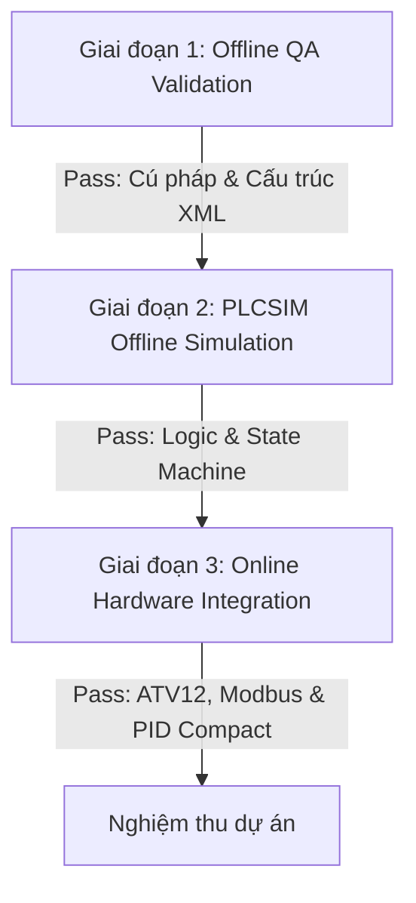

# KẾ HOẠCH KIỂM THỬ VÀ XÁC MINH SCL (SCL TEST & VERIFICATION PLAN)

Tài liệu này đặc tả quy trình kiểm thử ngoại tuyến (offline) và trực tuyến (online) cho hệ thống điều khiển Mixing nước tương Maggi 2026 sau khi rewrite sang ngôn ngữ SCL. Kế hoạch này áp dụng cho cả hai biến thể: **Variant A (1 PLC)** và **Variant B (2 PLC)**.

> [!IMPORTANT]
> **Quy ước đặt tên tag mới:**
> Toàn bộ các tag, khối dữ liệu (DB), hàm (FC/FB) mới trong bản SCL **không sử dụng tiền tố `AI_`**. Các Watch Table và kịch bản test dưới đây tuân thủ quy ước đặt tên mới này.

---

## 1. Phương Pháp & Công Cụ Kiểm Thử (Testing Methodology & Tools)

Hệ thống sẽ được kiểm thử qua 3 giai đoạn chính:

### 1.1. Công cụ sử dụng:
- **Offline:** 
  - Trình kiểm tra cú pháp Python.
  - S7-PLCSIM V18 (Mô phỏng CPU S7-1200).
  - TIA Portal V18 Watch Tables (Giám sát và ép giá trị).
- **Online:**
  - PLC S7-1200 thực tế (CPU 1214C / 1215C).
  - Biến tần Altivar 12 (ATV12) + Board CB1241 Modbus RTU.
  - Thiết bị đo đạc thật (Cảm biến nhiệt độ Pt100, cảm biến lưu lượng, van tuyến tính).

---

## 2. Kịch Bản Mô Phỏng Ngoại Tuyến (Offline Simulation Scenarios)

Do PLCSIM thông thường không mô phỏng được truyền thông Modbus TCP qua lại giữa 2 PLC ảo và không có biến tần thật, ta thực hiện các kịch bản mô phỏng logic bằng cách sử dụng **Watch Table** để điều hướng tín hiệu và giả lập phản hồi của thiết bị.

### 2.1. Kịch Bản 1: Kiểm thử State Machine tuần tự (Variant A & B)
Mục tiêu: Đảm bảo chu trình chuyển trạng thái từ Bước 0 (Idle) đến khi hoàn thành xả đáy diễn ra đúng logic thời gian và lưu lượng.

*   **Bước 1: Khởi tạo hệ thống**
    1. Kích hoạt cờ mô phỏng: Set `HmiData.che_do_manual` = `False`.
    2. Nạp Recipe mặc định: Set `RecipeData.recipe_default_maggi` được load vào `HmiData.Setpoint`.
    3. Kiểm tra trạng thái: `OperationData.Bon1.state` = `0` (Idle), `OperationData.Bon2.state` = `0` (Idle).
*   **Bước 2: Chu trình Bồn 1 (State 0 -> 10 -> 11 -> 12 -> 15)**
    1. Nhấn nút khởi động: Tạo xung `Nut_Khoi_Dong` = `True` rồi `False`.
    2. Bồn 1 chuyển sang `state` = `10` (Nạp nước). Van `V3230_Nuoc_Bon1` mở (`True`).
    3. Giả lập lưu lượng: Tăng giá trị đo thể tích `FQ3200_Bon1` lên `>= HmiData.Setpoint.sp_nuoc_bon1` (ví dụ: 100.0 L).
    4. Bồn 1 tự động chuyển sang `state` = `11` (Tip phụ gia bồn 1). Cờ `dosing_active` của Bồn 1 hạ xuống.
    5. Sau 3 giây (được đếm bởi Timer nội bộ), `state` chuyển sang `12` (Khuấy bồn 1). Cờ đầu ra động cơ khuấy `AGTR3260_Khuay_Bon1` lên `True`.
    6. Sau khi hết thời gian khuấy `HmiData.Setpoint.sp_time_khuay_bon1`, `state` chuyển sang `15` (Xả đáy bồn 1 sang bồn 2). Các van xả `V3232_Xa_Bon1`, `V3233_Xa_Bon1`, `V3234_Xa_Bon1` mở.
    7. Giả lập mức cạn: Giảm mức bồn 1 `LT3203_Bon1` về `0.0`. Khi mức `<= 0.5`, Bồn 1 chuyển sang `state` = `0` (Idle) và kích hoạt chu trình Bồn 2.
*   **Bước 3: Chu trình Bồn 2 (State 20 -> 21 -> 22 -> 23 -> 30 -> 31 -> 40 -> 0)**
    1. Bồn 2 tự động chuyển sang `state` = `20` (Nạp nước bổ sung). Van nước `V3235_Nuoc_Bon2` mở.
    2. Giả lập lưu lượng: Tăng `FQ3205_Bon2` lên `>= HmiData.Setpoint.sp_nuoc_bon2`. Van đóng, chuyển sang `21`.
    3. Sau 3 giây ở `state` = `21` (Tip phụ gia bồn 2), tự động chuyển sang `22` (Khuấy thuận).
    4. Động cơ VFD quay thuận (`VFD_Run` = `True`, `VFD_Dao_Chieu` = `False`). Sau khi hết thời gian chạy thuận, chuyển sang `23` (Khuấy ngược, `VFD_Dao_Chieu` = `True`).
    5. Hết thời gian chạy ngược, chuyển sang `30` (Gia nhiệt PID). Khối `PID_Compact_1` được enable (`pid_enable` = `True`).
    6. Giả lập nhiệt độ: Tăng nhiệt độ `TT3208_Bon2_Eff` lên `>= HmiData.Setpoint.sp_nhiet_do_bon2` (ví dụ: 75.0 °C).
    7. Nhiệt độ đạt, chuyển sang `31` (Thanh trùng). Hết thời gian giữ nhiệt, chuyển sang `40` (Chờ xả đáy).

### 2.2. Kịch Bản 2: Mô phỏng truyền thông Modbus RTU (ATV12)
Mục tiêu: Xác minh tuần tự điều khiển biến tần qua Modbus RTU và xử lý lỗi truyền thông không gây khóa hệ thống.

1.  **Trình tự khởi động biến tần:**
    - Khi hệ thống yêu cầu khuấy (State 22/23 hoặc khi bật PID), Contactor nguồn VFD `%Q0.0` đóng.
    - SCL Logic đợi thời gian trễ khởi động biến tần (ví dụ: 1.5 giây).
    - `FB_VFD_ATV12_ModbusRTU` bắt đầu chu kỳ gửi lệnh Modbus Master:
      - Step 0: Ghi Control Word (`16#0006` -> `16#0007` -> `16#000F` để Ready/Enable).
      - Step 1: Ghi tần số đặt (`FreqSetpoint` quy đổi tương ứng với setpoint Hz từ HMI).
      - Step 2: Đọc Status Word từ biến tần.
      - Step 3: Đọc tần số thực tế từ biến tần.
2.  **Giả lập mất kết nối Modbus RTU:**
    - Cưỡng bức lỗi Modbus Master: Set cờ lỗi `VFD_RTU_Buffer.Error` = `True`.
    - SCL Logic phải thực hiện cơ chế Retry:
      - Đợi 200 ms.
      - Phát lại yêu cầu Modbus.
      - Nếu lỗi lặp lại liên tiếp 3 lần: Set cờ báo lỗi xác nhận `VFD_MB_Error_Confirmed` = `True`.
      - Hệ thống dừng khẩn cấp, cắt contactor nguồn `%Q0.0`, kích hoạt cờ lỗi tổng `Sys.loi_tong` và hiển thị mã cảnh báo trên HMI.

### 2.3. Kịch Bản 3: Mô phỏng truyền thông Modbus TCP (Variant B - 2 PLC)
Mục tiêu: Kiểm tra truyền thông đồng bộ lệnh và trạng thái giữa PLC1 và PLC2 qua vùng nhớ đệm `DB_CommsData` (DB103).

1.  **Phía PLC1 (Client):**
    - `MB_CLIENT` ghi dữ liệu từ `DB_CommsData.plc2_send_buffer` sang Holding Register của PLC2.
    - Giả lập: Tester nhập giá trị trạng thái Nhánh 1 hoàn thành vào `plc2_send_buffer[0]`.
2.  **Phía PLC2 (Server):**
    - `MB_SERVER` nhận dữ liệu ghi vào Holding Register.
    - Giả lập: Quan sát thấy `DB_CommsData.plc2_recv_buffer[0]` cập nhật đúng giá trị của PLC1 gửi xuống.
    - Kiểm tra xử lý lỗi kết nối: Ngừng cập nhật cờ `Heartbeat` từ PLC1. Sau 5 giây không đổi giá trị, PLC2 phải tự động chuyển sang chế độ dừng an toàn (E-stop nội bộ) và báo lỗi mất truyền thông Modbus TCP.

---

## 3. Quy Hoạch Watch Tables Đánh Giá Logic (Watch Tables Plan)

Các bảng Watch Table được nạp vào TIA Portal để tester kiểm tra chéo logic chương trình.

### 3.1. PLC1 Watch Tables

#### Bảng `WT_PLC1_Main_Sequence` (Kiểm tra Sequence & I/O Nhánh 1)
| Tên Biến | Địa chỉ / Vùng nhớ | Kiểu Dữ Liệu | Chức năng kiểm thử |
| :--- | :--- | :--- | :--- |
| `Nut_Khoi_Dong` | `%I0.0` | Bool | Nút chạy hệ thống (Nhập xung) |
| `Nut_Dung` | `%I0.1` | Bool | Nút dừng hệ thống |
| `Nut_EStop` | `%I0.3` | Bool | Nút dừng khẩn vật lý |
| `HmiData.Setpoint.sp_nuoc_bon1` | `DB100.DB_VAR` | Real | Setpoint nước Bồn 1 |
| `HmiData.Setpoint.sp_nhiet_do_bon2` | `DB100.DB_VAR` | Real | Setpoint nhiệt độ Bồn 2 |
| `FQ3200_Bon1` | `%ID104` (hoặc DB101) | Real | Đo thể tích cấp vào Bồn 1 |
| `LT3203_Bon1` | `%ID108` (hoặc DB101) | Real | Đo mức liên tục Bồn 1 |
| `TT3208_Bon2_Eff` | DB101 | Real | Nhiệt độ hiệu dụng Bồn 2 |
| `OperationData.Bon1.state` | DB101 | Int | Bước tuần tự Bồn 1 (0, 10, 11, 12, 15) |
| `OperationData.Bon2.state` | DB101 | Int | Bước tuần tự Bồn 2 (0, 20, 21, 22, 23, 30, 31, 40) |
| `V3230_Nuoc_Bon1` | `%Q0.2` (hoặc DB101) | Bool | Trạng thái van cấp nước Bồn 1 |
| `AGTR3260_Khuay_Bon1`| `%Q0.1` | Bool | Trạng thái động cơ khuấy Bồn 1 |
| `Pump3264_Chuyen_Nhanh1`| `%Q1.1` | Bool | Bơm chuyển Nhánh 1 |

#### Bảng `WT_PLC1_PID_VFD` (Chẩn đoán lỗi & Giám sát PID/Biến tần)
| Tên Biến | Địa chỉ / Vùng nhớ | Kiểu Dữ Liệu | Chức năng kiểm thử |
| :--- | :--- | :--- | :--- |
| `Sys.loi_tong` | DB101 | Bool | Cờ báo lỗi tổng toàn hệ thống |
| `Sys.loi_dry_run` | DB101 | Bool | Lỗi chạy khô bơm |
| `Sys.loi_dosing` | DB101 | Bool | Lỗi quá thời gian nạp nước |
| `OperationData.Bon2.pid_enable`| DB101 | Bool | Cho phép chạy PID_Compact_1 |
| `OperationData.Bon2.pid_cv` | DB101 | Real | Giá trị CV điều khiển van hơi (%) |
| `CV3206_Hoi_Bon2` | `%QD108` | Real | Output AO điều khiển van hơi thật |
| `VFD_Bon2_Contactor` | `%Q0.0` | Bool | Contactor đóng nguồn biến tần ATV12 |
| `VFD_RTU_Buffer.StatusWord`| DB103 | Word | Đọc Status Word của biến tần |
| `VFD_RTU_Buffer.FreqActual`| DB103 | Real | Đọc tần số thực tế của biến tần |
| `VFD_MB_Error_Confirmed` | DB101 | Bool | Lỗi Modbus RTU xác nhận sau 3 lần retry |

### 3.2. PLC2 Watch Tables (Chỉ dùng cho Variant B)

#### Bảng `WT_PLC2_Main_Sequence` (Kiểm tra Sequence Nhánh 2)
| Tên Biến | Địa chỉ / Vùng nhớ | Kiểu Dữ Liệu | Chức năng kiểm thử |
| :--- | :--- | :--- | :--- |
| `OperationData.Bon4.state` | DB101 | Int | Bước tuần tự Bồn 4 |
| `HmiData.Setpoint.sp_nhiet_do_bon4` | DB100 | Real | Setpoint nhiệt độ Bồn 4 |
| `TT3219_Bon4_Eff` | DB101 | Real | Nhiệt độ hiệu dụng Bồn 4 |
| `OperationData.Bon4.pid_enable`| DB101 | Bool | Cho phép chạy PID_Compact_2 |
| `OperationData.Bon4.pid_cv` | DB101 | Real | Giá trị CV van hơi Bồn 4 (%) |
| `Pump3265_Chuyen_Nhanh2`| Physical Out | Bool | Bơm chuyển Nhánh 2 |
| `LT3218_Bon4` | Physical In | Real | Mức dung dịch Bồn 4 |

---

## 4. Kế Hoạch Tích Hợp Và Kiểm Thử Trực Tuyến (Online Integration Plan)

Khi chạy thực tế trên tủ điện với phần cứng thật, tester thực hiện các bước sau để đảm bảo an toàn thiết bị:

### 4.1. Bước 1: Kiểm tra cấu hình phần cứng (Hardware Check)
1. Xác minh HW ID của cổng CB1241 trên PLC1 đúng với giá trị cấu hình trong code SCL của khối `MB_COMM_LOAD` (không hard-code giá trị giả định).
2. Kiểm tra đấu nối dây Modbus RTU (chân A/B, điện trở đầu cuối 120 Ohm bật ở cả hai đầu CB1241 và biến tần ATV12).
3. Cấp nguồn điều khiển PLC, đảm bảo cả 2 CPU và thiết bị ngoại vi được cấp nguồn đầy đủ, không có lỗi phần cứng (đèn ERROR nhấp nháy đỏ).

### 4.2. Bước 2: Kiểm tra liên kết truyền thông (Communication Link Test)
1. **Modbus RTU:**
   - Đóng contactor `%Q0.0` cấp nguồn động lực cho ATV12.
   - Kiểm tra mã lỗi của `MB_MASTER` trong `FB_VFD_ATV12_ModbusRTU`. Đảm bảo mã trạng thái liên tục trả về `16#7000` (Không có yêu cầu) hoặc `16#0000` (Thành công), không bị lỗi `16#80E0` (Sai cấu hình cổng) hay `16#80C8` (Timeout).
2. **Modbus TCP:**
   - Kết nối cáp Ethernet giữa PLC1, PLC2 và HMI Switch.
   - Ping kiểm tra kết nối IP của các thiết bị.
   - Quan sát trạng thái kết nối của `MB_CLIENT` trên PLC1. Đảm bảo cờ `Done` nhấp nháy chu kỳ ổn định và cờ `Error` không bị dựng lên.

### 4.3. Bước 3: Kiểm tra chuyển đổi chế độ PID_Compact
1. Cấu hình PID_Compact V1.2 trong TIA Portal. Thực hiện quá trình **Pre-Tuning** và **Fine-Tuning** để tối ưu thông số PID.
2. Kiểm tra cơ chế chống khóa chế độ (Anti Mode-Lock):
   - Khi bước gia nhiệt bắt đầu (`state` = 30): Xác nhận giá trị `3` (Auto) được ghi vào `sRet.i_Mode`. Van hơi tuyến tính mở mượt mà dựa theo sai lệch nhiệt độ.
   - Khi dừng hệ thống hoặc chuyển sang bước xả: Xác nhận giá trị `0` (Inactive) được ghi vào `sRet.i_Mode` ngay lập tức. Van hơi đóng hoàn toàn (AO trả về `0.0` mA / `0.0` V).

### 4.4. Bước 4: Kiểm thử liên động an toàn (Safety Interlock & Alarm Verification)
Thực hiện kích hoạt các lỗi cố ý để kiểm tra khả năng dừng an toàn của hệ thống:
- **Lỗi dừng khẩn (E-Stop):** Nhấn nút E-Stop vật lý `%I0.3`. Toàn bộ đầu ra điều khiển (Bơm, Động cơ khuấy, Van hơi, Van cấp nước) phải lập tức ngắt. Trạng thái hệ thống chuyển về `0` (Idle).
- **Lỗi chạy khô (Dry-Run):** Giả lập đóng bơm chuyển nhanh Nhánh 1 nhưng giảm mức cảm biến báo cạn xuống `0`. Hệ thống phải dừng bơm sau tối đa 2 giây và cảnh báo lỗi khô.

---

## 5. Tiêu Chí Nghiệm Thu QA SCL (QA Pass Criteria)

Dự án SCL được nghiệm thu khi và chỉ khi vượt qua toàn bộ các tiêu chí sau:

1.  **Biên dịch (Compilation):** Biên dịch phần mềm và phần cứng đạt **0 Errors** trên cả 2 PLC CPU.
2.  **Độ phủ logic (Logic Coverage):** Toàn bộ chu trình hoạt động từ State 0 quay lại State 0 của các bồn chứa hoạt động trơn tru ở cả chế độ Auto và Manual.
3.  **An toàn (Safety):** Thời gian phản hồi dừng khẩn cấp và cắt contactor VFD khi có sự cố nhỏ hơn **100 ms**.
4.  **HMI:** Giao diện SCADA/HMI hiển thị chính xác các giá trị số thực dạng `99.9` hoặc `999.9` theo đúng Rule 5 của AGENTS.md, không bị lỗi tràn ký tự `###`. Các nhãn đơn vị đo lường cách ô IO Field đúng 8 pixel và sử dụng font chữ in đậm 13px.
