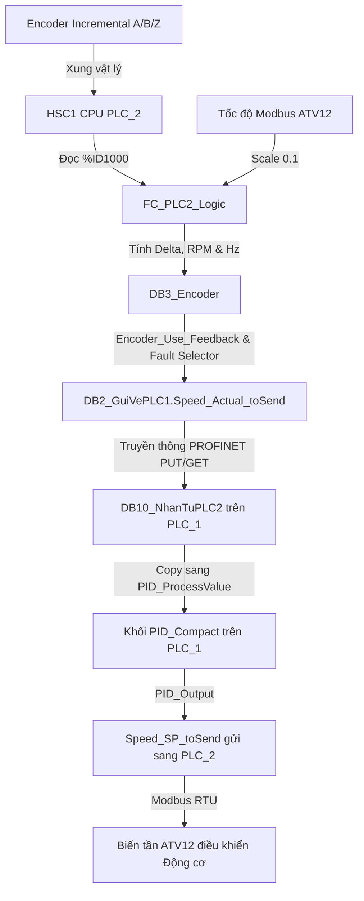

# HƯỚNG DẪN TÍCH HỢP VÀ VẬN HÀNH ENCODER HSC (PLC_2)

Tài liệu này hướng dẫn chi tiết các bước cấu hình phần cứng High-Speed Counter 1 (HSC1) trên PLC_2, nhập các file XML logic đã chỉnh sửa vào TIA Portal V18, và các bước chạy thử nghiệm thực tế.

---

## 1. Cấu hình phần cứng PLC_2 (Device Configuration)

Do các file XML của TIA Portal Openness không thể cấu hình trực tiếp phần cứng bên trong CPU, người lập trình **bắt buộc** phải thực hiện các bước cấu hình HSC1 thủ công trên TIA Portal V18 như sau:

1. Mở dự án **Bai_4_Profinet** trên TIA Portal V18.
2. Trong cây dự án (Project tree), nhấp đúp vào **Device configuration** của **PLC_2** (S7-1200 1212C hoặc 1214C DC/DC/DC).
3. Chọn CPU PLC_2, mở cửa sổ **Properties** bên dưới.
4. Tìm đến mục **High speed counters (HSC)** -> **HSC1**.
5. Nhấp chọn **Enable this high speed counter**.
6. Cấu hình các thông số cho HSC1:
   - **Counter type:** Chọn `Count`.
   - **Operating phase:** Chọn `A/B counter` hoặc `A/B counter fourfold` (đếm x4 cạnh xung).
   - **Counting direction:** Chọn `Count up` (hoặc cấu hình tự động theo Phase B).
   - **Signal evaluation:** Chọn `Fourfold` nếu muốn độ phân giải gấp 4 lần xung gốc (sẽ tương thích với cấu hình `Encoder_Use_Fourfold = TRUE` trong DB3).
7. Xem mục **Hardware inputs** để xác nhận địa chỉ chân đấu nối vật lý:
   - **Phase A input:** Mặc định là `I0.0`
   - **Phase B input:** Mặc định là `I0.1`
   - **Phase Z (Sync/Reset/Home) input:** Nếu dùng, cấu hình là `I0.3`
8. Nhấp vào mục **Digital inputs** -> **I0.0** và **I0.1** của CPU:
   - Tìm mục **Input filter** (Bộ lọc ngõ vào).
   - **QUAN TRỌNG:** Thay đổi thời gian lọc ngõ vào (Input filter time) xuống mức thấp hơn (ví dụ: `0.8 ms` hoặc `0.1 ms` hoặc `6.4 microseconds` tùy thuộc vào tần số xung tối đa của Encoder). Nếu để bộ lọc mặc định `6.4 ms`, PLC sẽ bỏ sót các xung tần số cao, dẫn đến đo tốc độ bị sai lệch lớn hoặc bằng 0.
9. Kiểm tra địa chỉ ngõ vào đúp của HSC1 trong phần **I/O Addresses**:
   - Địa chỉ bắt đầu ngõ vào mặc định là `1000` (được gọi là `%ID1000`).
   - Đảm bảo tag `%ID1000` được đặt tên là `HSC_1_Value` như trong file `Encoder_Tags.xml`.

---

## 2. Đấu nối phần cứng vật lý

Đảm bảo đấu nối dây điện của Encoder dòng incremental 24V vào PLC_2 theo đúng sơ đồ sau:
- Dây nguồn Encoder (24VDC) -> Nối vào nguồn 24V cấp cho PLC.
- Dây 0V Encoder -> Nối chung với chân 0V nguồn PLC (chân M của ngõ vào PLC).
- **Phase A Encoder** -> Đấu vào chân **I0.0** của PLC_2.
- **Phase B Encoder** -> Đấu vào chân **I0.1** của PLC_2.
- **Phase Z Encoder** -> Đấu vào chân **I0.3** của PLC_2 (nếu dùng để đồng bộ).

---

## 3. Nhập (Import) file XML vào PLC_2

Bạn có thể nhập các file XML từ thư mục patch vào PLC_2 theo thứ tự:

1. **Import Tag Table:**
   - Click chuột phải vào **PLC tags** của PLC_2 -> **Import...**
   - Chọn đường dẫn đến file: [Encoder_Tags.xml](file:///D:/AI_Agent_PLC_LADDER_ONLY/projects/Bai_4_Profinet_encoder_patch/02_PLC_2/Tags/Encoder_Tags.xml)
2. **Import Data Block (DB3):**
   - Click chuột phải vào **Program blocks** của PLC_2 -> **Add new block** -> Tạo DB mới đặt tên là `DB3_Encoder` với số block là `3`.
   - Click chuột phải vào `DB3_Encoder` -> chọn **Generate source from block** (nếu nhập thủ công) hoặc dùng Openness Importer nạp file: [DB3_Encoder.xml](file:///D:/AI_Agent_PLC_LADDER_ONLY/projects/Bai_4_Profinet_encoder_patch/02_PLC_2/Blocks/DB3_Encoder.xml).
3. **Import Logic Block (FC10):**
   - Nhập đè file logic FC đã được cấy phần xử lý encoder: [FC_PLC2_Logic.xml](file:///D:/AI_Agent_PLC_LADDER_ONLY/projects/Bai_4_Profinet_encoder_patch/02_PLC_2/Blocks/FC_PLC2_Logic.xml).
   - *Lưu ý:* Khi import, TIA Portal sẽ tự động hỏi tạo các DB timer hệ thống `tonSample_DB` và `tonNoPulse_DB` cho các khối thời gian TON được sử dụng trong FC. Hãy chọn đồng ý tạo.
4. **Biên dịch dự án:**
   - Click chuột phải vào **PLC_2** -> **Compile** -> **Hardware and software (only changes)** để đảm bảo dự án không có bất kỳ lỗi biên dịch nào.

---

## 4. Giải thích luồng dữ liệu mới

---

## 5. Danh sách tham số cấu hình trong `DB3_Encoder`

Người vận hành có thể giám sát và hiệu chỉnh các thông số trực tiếp trong `DB3_Encoder` qua Watch Table:

- **`Encoder_PPR` (Real - Mặc định `1000.0`):** Số xung thực tế của Encoder trên 1 vòng quay. Có thể hiệu chỉnh trong khoảng `500.0` đến `5000.0`.
- **`Encoder_Use_Fourfold` (Bool - Mặc định `TRUE`):** Nếu bật TRUE, xung hiệu dụng sẽ nhân 4 (`Effective_PPR = PPR * 4.0`), phù hợp cấu hình đếm x4 cạnh xung A/B của HSC1.
- **`Encoder_SampleTime_s` (Real - Mặc định `0.1`):** Chu kỳ lấy mẫu đếm xung (0.1 giây = 100ms).
- **`Encoder_Motor_Pole_Pairs` (Real - Mặc định `2.0`):** Số cặp cực của động cơ (mặc định 2 cho động cơ 4 cực). Dùng để đổi tốc độ vòng/phút (RPM) sang tần số điện (Hz).
- **`Encoder_Use_Feedback` (Bool - Mặc định `TRUE`):** Cờ cho phép chạy chế độ phản hồi từ Encoder. Nếu tắt (FALSE), hệ thống sẽ tự động sử dụng phản hồi tốc độ Modbus từ biến tần.
- **`Encoder_Fault` (Bool):** Cờ báo lỗi Encoder. Nếu động cơ được kích hoạt chạy (`Motor_Contactor` = TRUE) mà không phát hiện xung Encoder thay đổi (`Delta` = 0) liên tục trong 3 giây, cờ này sẽ chuyển lên TRUE.
- **`Encoder_Fallback_Active` (Bool):** Cờ báo trạng thái dự phòng đang hoạt động (khi tắt cho phép dùng encoder hoặc khi xảy ra lỗi).

---

## 6. Cơ chế bảo vệ và Fallback tự động

Hệ thống tích hợp logic an toàn đặc biệt để bảo vệ động cơ và cơ cấu cơ khí:
- Khi đang chạy động cơ (`Motor_Contactor` = TRUE) mà Encoder bị hỏng (mất nguồn, đứt dây Phase A/B), sau 3 giây không có xung (`Delta = 0`), cờ `Encoder_Fault` sẽ SET lên TRUE.
- Khi cờ `Encoder_Fault` kích hoạt, hệ thống sẽ tự động bật `Encoder_Fallback_Active` = TRUE.
- Bộ chọn (Selector) lập tức chuyển đổi nguồn feedback gửi về PLC_1 từ `Encoder_Hz` sang giá trị ước lượng của biến tần `MB_ActualSpeed * 0.1`.
- **Lợi ích:** PID của PLC_1 vẫn nhận được giá trị tốc độ thực gần đúng từ biến tần, tránh hiện tượng PID tưởng động cơ đang đứng im (feedback = 0) dẫn đến vọt ga phát hết công suất (runaway) gây hỏng hóc cơ khí nghiêm trọng.
- Sau khi khắc phục lỗi phần cứng Encoder, người vận hành nhấn nút **Reset** trên giao diện HMI (kích hoạt `DB1_NhanTuPLC1.Reset_Cmd`) để xóa cờ lỗi `Encoder_Fault` và phục hồi về feedback Encoder.

---

## 7. Các bước kiểm tra chạy thử nghiệm (Commissioning & Testing)

Hãy tuân thủ các bước thử nghiệm sau để kiểm tra hệ thống:

### Bước 7.1: Kiểm tra phần cứng đếm xung
1. Động cơ ở trạng thái dừng (`Motor_Contactor` = FALSE).
2. Tạo một **Watch table** mới trong TIA Portal PLC_2.
3. Thêm biến `HSC_1_Value` (%ID1000) và `DB3_Encoder.Encoder_Count_Current` vào bảng.
4. Dùng tay quay nhẹ trục động cơ hoặc trục Encoder.
5. Quan sát giá trị `HSC_1_Value` và `Encoder_Count_Current` tăng hoặc giảm liên tục theo chiều quay. Nếu giá trị không đổi, kiểm tra lại đấu nối nguồn và chân A/B của Encoder.

### Bước 7.2: Kiểm tra chiều quay và đơn vị đo
1. Chạy động cơ ở chế độ Manual với tần số thấp (ví dụ: 10.0 Hz).
2. Kiểm tra chiều quay động cơ và giá trị xung:
   - Nếu động cơ chạy tiến, xung đếm phải tăng (RPM > 0, Hz > 0).
   - Nếu động cơ chạy lùi, xung đếm phải giảm.
   - Nếu chạy tiến mà xung giảm (RPM âm), hãy đảo 2 chân dây đấu ngõ vào Phase A và Phase B (đảo dây I0.0 và I0.1) hoặc cấu hình đảo chiều đếm trong cấu hình HSC1.
3. So sánh giá trị tốc độ đo được:
   - Đọc giá trị `DB3_Encoder.Encoder_Hz` và so sánh với tần số thực tế hiển thị trên màn hình biến tần hoặc `MB_ActualSpeed * 0.1`.
   - Nếu có sai lệch lớn, kiểm tra lại thông số `Encoder_PPR` và `Encoder_Motor_Pole_Pairs` trong `DB3_Encoder`.

### Bước 7.3: Kiểm tra cơ chế Fallback và Lỗi mất xung
1. Cho động cơ chạy ở tốc độ 20.0 Hz trong chế độ tự động sử dụng Encoder (`Encoder_Use_Feedback` = TRUE).
2. Giả lập lỗi bằng cách rút dây tín hiệu ngõ vào I0.0 hoặc ngắt nguồn của Encoder.
3. Đợi 3 giây.
4. Xác nhận các hiện tượng sau:
   - Cờ lỗi `DB3_Encoder.Encoder_Fault` chuyển sang TRUE.
   - Cờ `DB3_Encoder.Encoder_Fallback_Active` chuyển sang TRUE.
   - Giá trị `DB2_GuiVePLC1.Speed_Actual_toSend` chuyển sang giá trị tốc độ từ biến tần (khoảng 20.0 Hz) thay vì rơi về 0.0.
   - Động cơ vẫn tiếp tục quay ổn định ở tốc độ 20.0 Hz dưới sự điều khiển của PID PLC_1 (không bị rú hoặc tăng tốc đột ngột).
5. Đấu nối lại tín hiệu Encoder, nhấn nút **Reset** trên HMI và kiểm tra cờ lỗi biến mất, hệ thống quay lại dùng Encoder bình thường.
